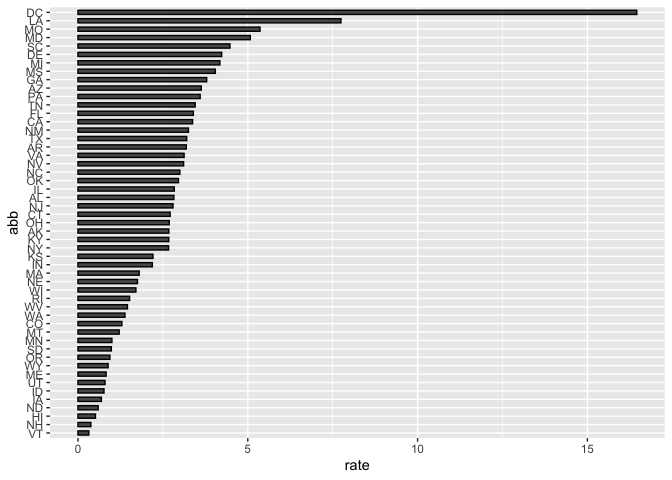

Report on Fun Murders
================
Leo Liang
20/08/2020

## Introduction

This is a report on 2010 gun murder rates obtained from FBI reports. The
original data was obtained from \[this Wikipedia page\]

We are going to ues the following library:

``` r
library(tidyverse)
```

and load the data we already wrangled:

``` r
load("rda/murders.rda")
```

## Murder rate by state

We note the large state to state variability by generating a barplot
showing the murder rate by state:

<!-- -->
